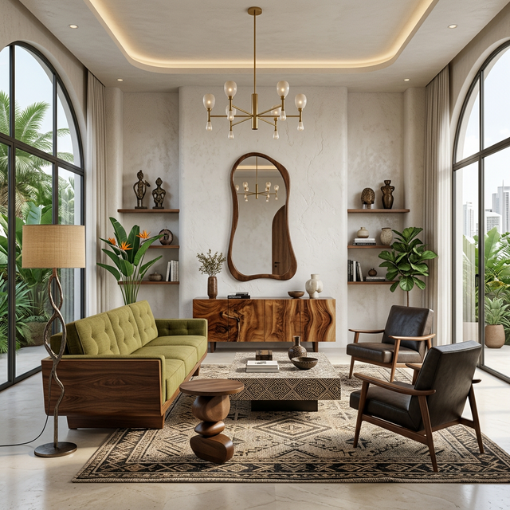
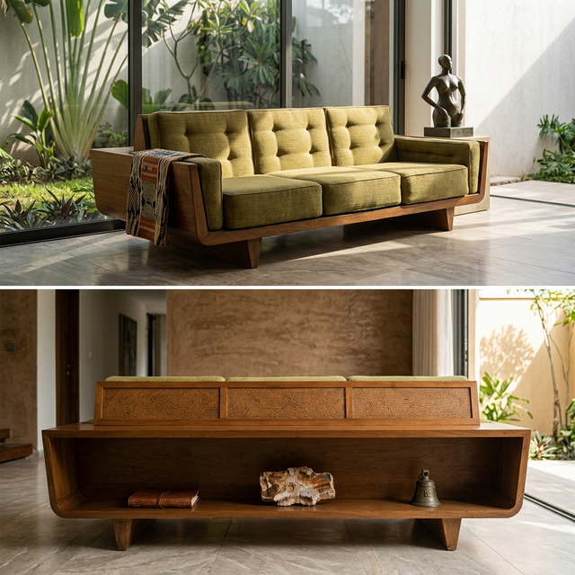
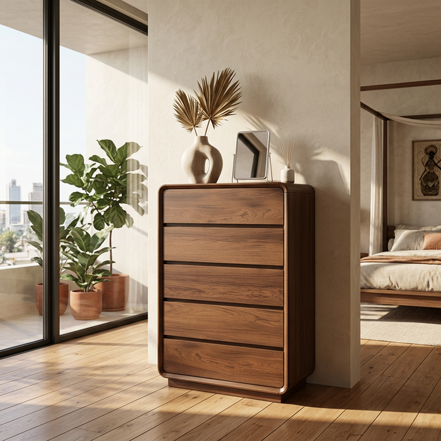

# GreatWood



A premium furniture e-commerce platform built for the Nigerian market. Design-led, trust-first, with real product photography and an editorial approach to online retail.

## Tech Stack

- **Framework:** Next.js 14 (App Router, Server Components)
- **Language:** TypeScript
- **Styling:** CSS Modules with custom design tokens
- **Images:** next/image with optimized loading
- **State:** Zustand (cart), React Context (UI)
- **Data Layer:** Mock Shopify + Sanity CMS structure (ready for production API swap)

## Features

- Product detail pages with variant-aware gallery switching (click a swatch, entire gallery changes)
- Hover crossfade on product tiles
- Sticky buy box with quantity controls and add-to-bag
- Trust signal system (delivery estimates, care guides, concierge CTA)
- Responsive grid layouts with editorial typography
- Blueprint/dimensions module with real product photography
- Filter bar and collection pages
- Cart drawer with line item management

## Running Locally

```bash
npm install
npm run dev
```

Open [http://localhost:3000](http://localhost:3000)

## Project Structure

```
src/
├── app/                  # Next.js App Router pages
│   ├── page.tsx          # Homepage
│   ├── shop/             # Product listing
│   ├── product/[slug]/   # Product detail pages
│   └── collections/      # Collection pages
├── components/
│   ├── layout/           # Container, Grid, Header, Footer
│   ├── pdp/              # Gallery, BuyBox, PDPClient, Dimensions
│   ├── shared/           # ProductTile, SwatchSelector, PriceBlock
│   └── ui/               # Button, Badge, Accordion, ImageFrame
└── lib/
    ├── cms/              # Shopify + Sanity mock data layer
    ├── store/            # Zustand cart store
    └── utils/            # Delivery calculator, formatters
```

## Interface

<p align="center">
  
  
</p>
