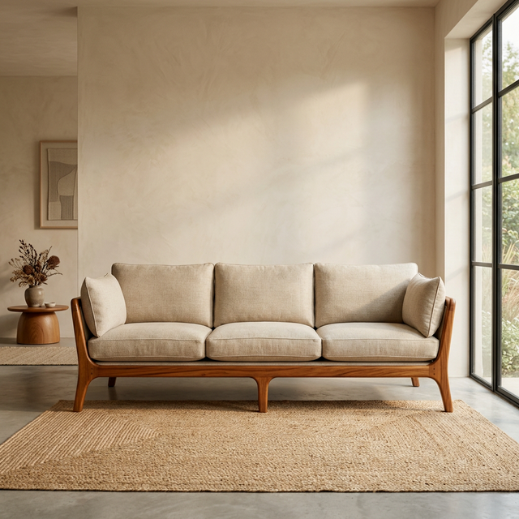
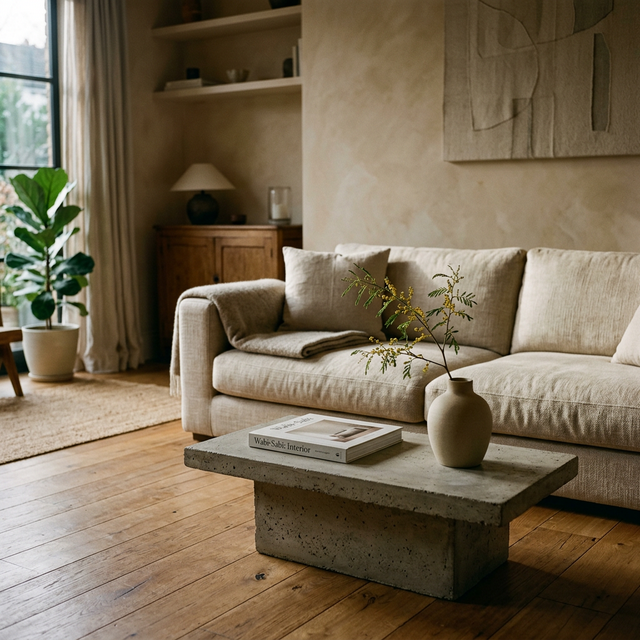
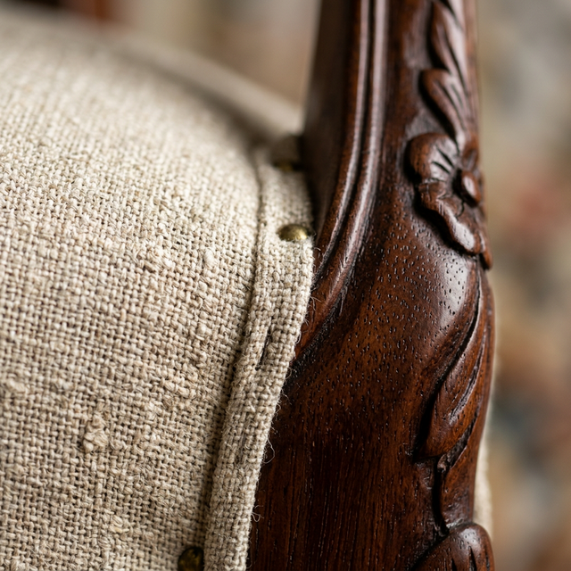
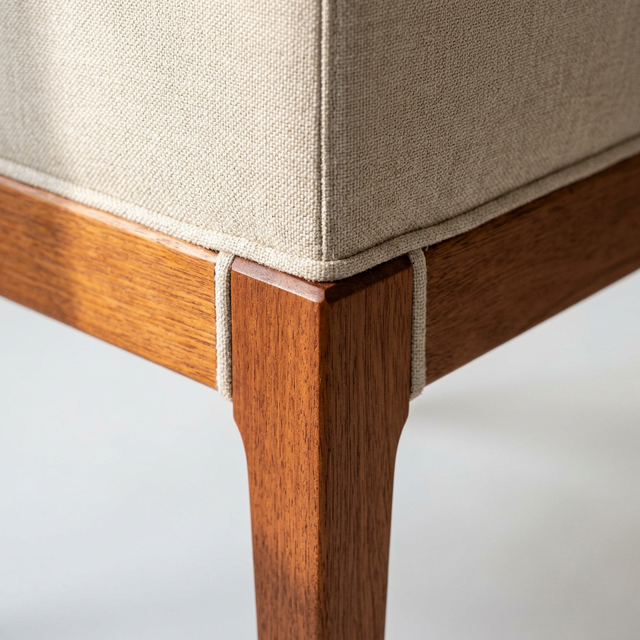
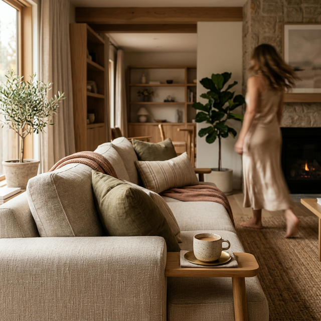

# Photography & Visual Production Direction

*Owner: Photography Director*

## 1. Core Purpose
The photography for this brand is our primary engine of trust. It is not purely decorative; it is evidence. Every image, video, and animation should systematically reduce the anxiety of the "Expectation Gap" (the fear of *what I ordered vs. what I got*).

## 2. The 5-Shot Standard (Target per Product)
To sell "Certainty" and "Elevated Taste," flagship product pages should aim for these five specific images:

1.  **Establishing Hero:** 
    *   *Purpose:* Create immediate desire and architectural presence.
    *   *Style:* The piece commands the frame. Generous breathing room (padding) around the edges. Lit to highlight the primary material. 
    *   *Aspect Ratio:* 16:9 or 21:9 (Desktop PDP Hero), 4:5 (PLP Card/Mobile Hero).
    *   *Prompt Engineer Reference:* `Premium Nigerian hardwood and oatmeal linen sofa, centered establishing hero shot | Minimalist styling, warm alabaster plaster wall background, spacious | Soft directional lighting imitating late afternoon window light, creating soft shadows wrapping around curves | Shot on 50mm lens, eye-level, deep depth of field | Editorial commercial furniture photography, organic Nigerian modernism aesthetic, high contrast, 8k resolution, unretouched organic feel`
      
2.  **Contextual Lifestyle:** 
    *   *Purpose:* Prove the piece exists in beautiful reality, anchoring scale and mood.
    *   *Style:* Curated restraint. 2-3 intentional props max (e.g., an art book, a single branch in a ceramic vase). Avoid clutter. Moody, softly controlled directional light.
    *   *Aspect Ratio:* Flexible (3:4 or 16:9).
    *   *Prompt Engineer Reference:* `Premium oatmeal linen sofa in a curated elegant living room | A low raw concrete coffee table with a single art book and a ceramic vase with an acacia branch | Warm alabaster plaster walls, natural wooden floor | Softly controlled directional window light, moody late afternoon atmosphere | Shot on 35mm lens, f/4 for slight background separation, eye-level | Lifestyle interior photography, restrained luxury, architectural digest style, warm 3500K color temperature`
      
3.  **Macro Material (The Trust Shot):** 
    *   *Purpose:* Unmanipulated proof of quality.
    *   *Style:* Extreme close-up. Should clearly show wood grain, fabric weave, leather pores, or metal finish. Very shallow depth of field (f/2.8 or lower) to isolate the texture.
    *   *Aspect Ratio:* 1:1 or 4:5.
    *   *Prompt Engineer Reference:* `Extreme close-up macro shot of premium oatmeal linen fabric upholstery over a carved mahogany wood frame | No background, pure focus on the material interplay | Soft diffused studio lighting highlighting the fabric weave and wood grain pores | Shot on 100mm macro lens, very shallow depth of field, f/2.8 bokeh | Abstract material study, commercial furniture detail photography, highly detailed, photorealistic`
      
4.  **Structural Integrity (The Craft Shot):** 
    *   *Purpose:* Evidence of durability and operational exactness.
    *   *Style:* Focused on a joinery detail, a seam, a zipper, or the leg attachment. Demonstrates how the piece is built, not just how it looks.
    *   *Aspect Ratio:* Flexible.
    *   *Prompt Engineer Reference:* `Close-up detail shot of a flawless mortise and tenon wood joinery connecting a mahogany furniture leg to an oatmeal linen upholstered base | Clean alabaster background | Harder directional light to emphasize the precision of the seam and the solidity of the craft | Shot on 85mm lens, f/4, angled to show three dimensions of the joint | Commercial furniture craftsmanship photography, hyper-detailed, physical perfection, warm color palette`
      
5.  **Scale / Human Reference:** 
    *   *Purpose:* Instantly communicate dimensional presence without requiring the user to measure their room immediately.
    *   *Style:* Subtle human presence (e.g., a hand testing the cushion, a blurred figure walking past in the background) or universally scaled objects (a standard doorway, a coffee cup). The human presence should not distract from the product—faces are generally avoided.
    *   *Prompt Engineer Reference:* `Premium oatmeal linen sofa in a warm modern room, subtle human presence with a blurred female figure in a flowing silk dress walking past in the background out of focus | A ceramic coffee cup on the armrest for scale | Moody warm late day lighting, natural shadows | Shot on 50mm lens, f/2.0 focusing perfectly on the sofa while the person blurs into motion | Lifestyle editorial photography, aspirational premium furniture, muted earth tones`
      

## 3. Lighting & Aesthetic Posture
*   **The Look:** Moody, warm, and highly controlled. "Restrained Luxury."
*   **Methodology:** Avoid flat, clinical, blown-out ecommerce lighting. We use directional lighting (emulating natural window light) to create soft shadows that wrap around curves and accentuate textures.
*   **Color Temperature:** Warm (3200K - 4500K). The light should feel like late afternoon in a beautiful, calm space.

## 4. Backgrounds & Environments
*   **No Pure Whites:** We strongly avoid the pure #FFFFFF seamless backdrop. It often feels generic and "mass-market."
*   **Approved Backgrounds:** Warm alabaster, soft oatmeal, deep charcoal, textured plaster walls, or raw concrete. The environment must complement the Nigerian earth tones of the furniture without overpowering them.
*   **Sets:** Physical sets are preferred, but high-end CGI is acceptable if it meets our realism standards (see below).

## 5. CGI / 3D Rendering Realism Standard
When physical shoots are not feasible or scale demands 3D rendering, CGI must be virtually indistinguishable from photography. 
*   **Lighting Realism:** Use physically accurate HDRI lighting mimicking our studio or natural window light guidelines. Avoid mathematically perfect, multi-directional "even" lighting.
*   **Material Truth:** Textures must have accurate roughness, bump, and displacement maps. A 3D linen sofa must show procedural thread variation, not a flat tiled pattern. Wood grain cannot repeat obviously.
*   **The "Imperfection" Rule:** Perfect renders look fake. Add microscopic imperfections to build trust: subtle dust motes in the air, a slight unevenness in the plaster wall, organic wrinkles in the fabric cushions, or a very gentle depth-of-field blur.
*   **Color Matching:** 3D renders should be color-graded to deeply match physical fabric/wood swatches in natural daylight.

## 6. Motion & Video Guidelines
Video is used for atmospheric reinforcement, not hyper-active commercials.
*   **Pacing:** Slow, stabilized, horizontal pans. Deliberate sweeps over textures. 
*   **Cuts:** Minimal. Avoid rapid cuts, frenetic transitions, or "jiggle." 
*   **Content:** A 5-second slow pan of light moving across a mahogany tabletop typically does more for trust than a 30-second fast-paced lifestyle ad.

## 7. Required Asset Matrix by Channel
Different surfaces require different asset treatments to optimize for context.

| Channel / Surface | Asset Type | Aspect Ratio | Key Requirement |
| :--- | :--- | :--- | :--- |
| **Homepage Hero** | Hero / Lifestyle | 16:9 (Desktop), 4:5 (Mobile) | Aspirational scale, dramatic lighting, low text-interference zones. |
| **PLP (Category)** | Establishing Product | 4:5 | Strict floor baseline alignment across all products. Soft Alabaster background. |
| **PDP (Product)** | The 5-Shot Standard | Mixed (16:9, 4:5, 1:1) | Maximum visual evidence (macro, craft, scale, lifestyle). |
| **Swatches** | Macro Texture | 1:1 (Circle/Square) | Mathematically identical lighting across all swatches for accurate comparison. |
| **Lookbook** | Lifestyle / Contextual | 3:4, 4:5, 16:9 | High prop-curation (max 3), deep shadows, visually rich. |
| **Ads (Performance)** | Product + Benefit | 1:1, 4:5, 9:16 | Clear product focus, high contrast, readable on small screens. |
| **Social (IG/TikTok)**| Lifestyle + Video | 4:5, 9:16 | Authentic, slightly less "produced" feel. Focus on motion and scale. |

## 8. File Delivery, Export Specs & Naming Conventions
To maintain an organized, high-performance CMS, all delivered assets must adhere to this structure:

*   **File Naming:** `[SKU]-[Category]-[Shot_Type]-[Angle]-[Modifier].[ext]`
    *   *Example:* `SOF-001-Sofa-Hero-45Deg-Oatmeal.jpg`
    *   *Example:* `TBL-042-Dining-Macro-WoodGrain.jpg`
    *   *Example:* `CHR-018-Accent-Context-Lifestyle.jpg`
*   **Format Specs (Source/Archive):** Uncompressed 16-bit TIFF or maximum quality JPEG (Adobe RGB).
*   **Format Specs (Web Delivery):** Next-gen formats (WebP/AVIF) encoded at 80-85% quality to balance retina-sharpness against page load speed. 
*   **Resolution Targets:**
    *   *Hero Desktop:* 2880px width (2x retina)
    *   *Standard PLP/PDP:* 1500px width
    *   *Macro/Zoom:* 2000px width minimum
*   **Color Space:** sRGB for all final web exports.

## 9. Execution & Handoff Checklist
Before any batch of photography is cleared for uploading to the CMS:
*   [ ] Does the image look generic or template-driven? (If yes, flag for review/rework).
*   [ ] Can the user clearly distinguish the structural and material quality? (If no, consider reshooting/re-rendering).
*   [ ] Does the lighting create a calm, premium atmosphere? (If no, adjust grade).
*   [ ] Are the file sizes and formats optimized for performance? (Required standard).
